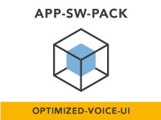
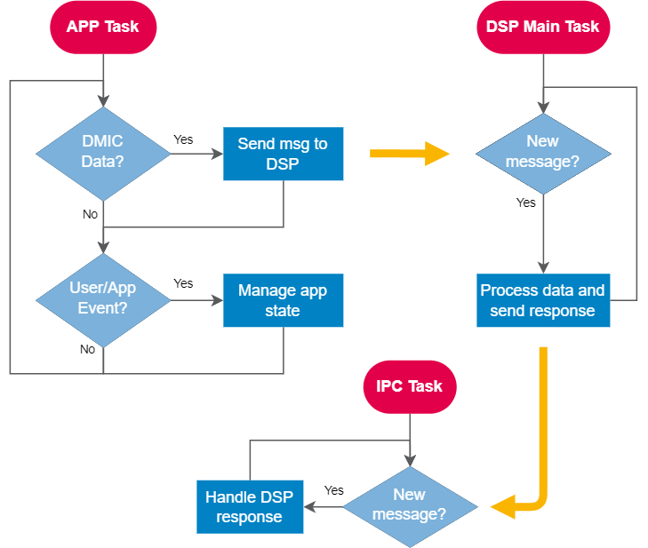

# NXP Application Code Hub
[](https://www.nxp.com)

## Power Optimized Wearables User Interface for the i.MX RT595


This repository holds the [Power Optimized Wearables User Interface for the i.MX RT595 App SW Pack](https://www.nxp.com/design/software/embedded-software/application-software-packs/application-software-pack-power-optimized-wearables-user-interface-for-the-i-mx-rt595:APP-SW-PACK-POWER-OPTIMIZED-VOICE-UI)  featuring local voice control using NXP's <a href="https://www.nxp.com/design/software/embedded-software/voice-intelligent-technology:VOICE-INTELLIGENT-TECHNOLOGY">Voice Intelligent Technology (VIT)</a> on the i.MX RT595 Crossover MCU.

<p align="center">
	
</p>

#### Boards: EVK-MIMXRT595
#### Categories: Voice
#### Peripherals: I2C, UART, DMA
#### Toolchains: MCUXpresso IDE

## Table of Contents
1. [Resources](#step1)
2. [Assemble the Application](#step2)
3. [Build and Run the Application](#step3)
4. [Application Overview](#step4)
6. [Other Reference Applications](#step5)
7. [Support](#step6)
8. [Release Notes](#step7)

## 1. Resources<a name="step1"></a>
* Purchase supported board.
    * [MIMXRT595-EVK](https://www.nxp.com/design/development-boards/i-mx-evaluation-and-development-boards/i-mx-rt595-evaluation-kit:MIMXRT595-EVK)
* Install [MCUXpresso IDE v11.8.0+](https://www.nxp.com/design/software/development-software/mcuxpresso-software-and-tools-/mcuxpresso-integrated-development-environment-ide:MCUXpresso-IDE).
* [Application Note AN13758](https://www.nxp.com/webapp/Download?colCode=AN13758) - Covers technical details of the software pack.
* [Lab Guide](https://github.com/nxp-appcodehub/ap-optimized-voice-ui/blob/main/optimized_voice_ui/app/cm33/doc/ap_optimized_voice_ui_lab_guide.pdf) and [Video Walkthrough](https://www.nxp.com/design/training/application-software-pack-power-optimized-wearables-user-interface-for-the-i-mx-rt595:APP-SW-PACK-POWER-OPTIMIZED-VOICE-UI) - Walks you through downloading, importing, and running the software pack.

## 2. Assemble the Application<a name="step2"></a>

You need to have both Git and [West](https://docs.zephyrproject.org/latest/develop/west/index.html) installed, then execute below commands to gather the whole APP-SW-PACKS/optimized-voice-ui delivery at revision ```${revision}``` and place it in a folder named ```ap_optimized_voice_ui```. 
```
west init -m https://github.com/nxp-appcodehub/ap-optimized-voice-ui --mr ${revision} ap_optimized_voice_ui
cd ap_optimized_voice_ui
west update
```
Replace ```${revision}``` with any SDK revision you wish to achieve. This can be ```main``` if you want the latest state, or any commit SHA.

## 3. Build and Run the Application<a name="step3"></a>

To build and run the application please refer to the [Lab Guide](https://github.com/nxp-appcodehub/ap-optimized-voice-ui/blob/main/optimized_voice_ui/app/cm33/doc/ap_optimized_voice_ui_lab_guide.pdf) or check the steps in [Run a project using MCUXpresso IDE](https://github.com/nxp-appcodehub/mcux-sdk/blob/main/docs/run_a_project_using_mcux.md).

## 4. Application Overview<a name="step4"></a>

This software application pack demonstrates how to design a power optimized application with local voice control using NXP's [Voice Intelligent Technology (VIT)](https://www.nxp.com/vit) on the i.MX RT595.

After initializing the necessary hardware, it launches the following tasks:
1. **[CM33] APP_Task:**  Main application task to handle the user/application events and manage the current application state. 
2. **[CM33] APP_DSP_IPC_Task:** Inter-processor communication (IPC) task to handle the DSP response messages.
3. **[CM33] APP_Idle:** Function called from the RTOS idle task to handle the power mode entry of the device.
4. **[DSP] DSP_Main:** DSP main task to handle the CM33 messages.

The general flow of the tasks is shown below. \



## 5. Other Reference Applications<a name="step5"></a>
For other rapid-development software bundles please visit the [Application Software Packs](https://www.nxp.com/appswpack) page.

For SDK examples please go to the [MCUXpresso SDK](https://github.com/nxp-appcodehub/mcux-sdk/) and get the full delivery to be able to build and run examples that are based on other SDK components.

## 6. Support<a name="step6"></a>
You can access more technical support at our [application software pack community](https://community.nxp.com/t5/Application-Software-Packs/bd-p/app-sw-packs).

#### Project Metadata
<!----- Boards ----->
[](https://github.com/search?q=org%3Anxp-appcodehub+EVK-MIMXRT595+in%3Areadme&type=Repositories)

<!----- Categories ----->
[](https://github.com/search?q=org%3Anxp-appcodehub+voice+in%3Areadme&type=Repositories)

<!----- Peripherals ----->
[](https://github.com/search?q=org%3Anxp-appcodehub+i2c+in%3Areadme&type=Repositories) [](https://github.com/search?q=org%3Anxp-appcodehub+uart+in%3Areadme&type=Repositories) [](https://github.com/search?q=org%3Anxp-appcodehub+dma+in%3Areadme&type=Repositories)

<!----- Toolchains ----->
[](https://github.com/search?q=org%3Anxp-appcodehub+mcux+in%3Areadme&type=Repositories)

Questions regarding the content/correctness of this example can be entered as Issues within this GitHub repository.

>**Warning**: For more general technical questions regarding NXP Microcontrollers and the difference in expected functionality, enter your questions on the [NXP Community Forum](https://community.nxp.com/)

[](https://www.youtube.com/@NXP_Semiconductors)
[](https://www.linkedin.com/company/nxp-semiconductors)
[](https://www.facebook.com/nxpsemi/)
[](https://twitter.com/NXP)

## 7. Release Notes<a name="step7"></a>
| Version | Description / Update                           | Date                        |
|:-------:|------------------------------------------------|----------------------------:|
| 1.0     | Initial release on Application Code Hub        | September 7<sup>th</sup> 2023 |

